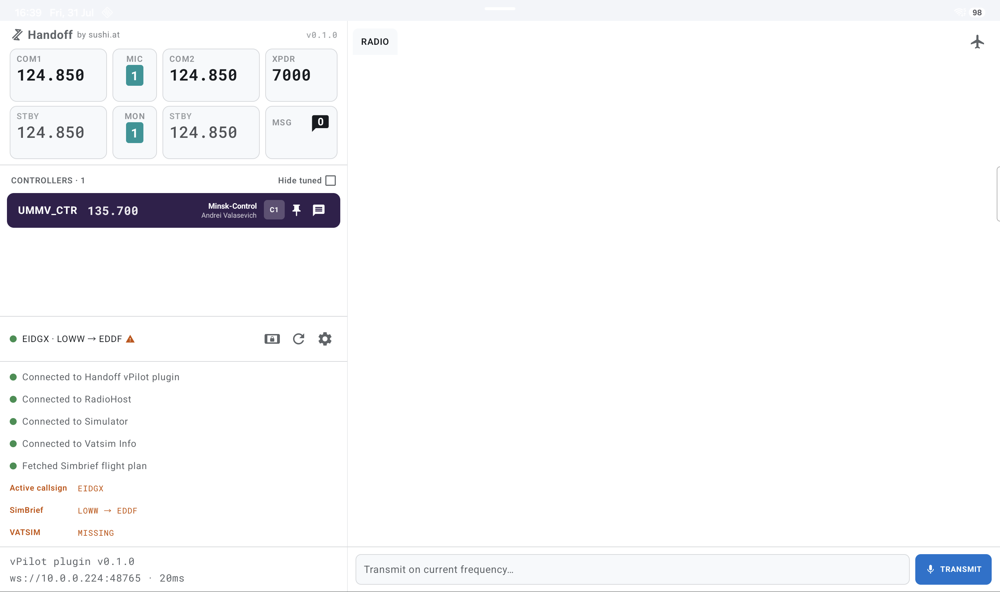
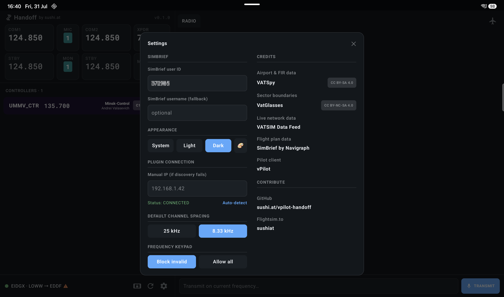
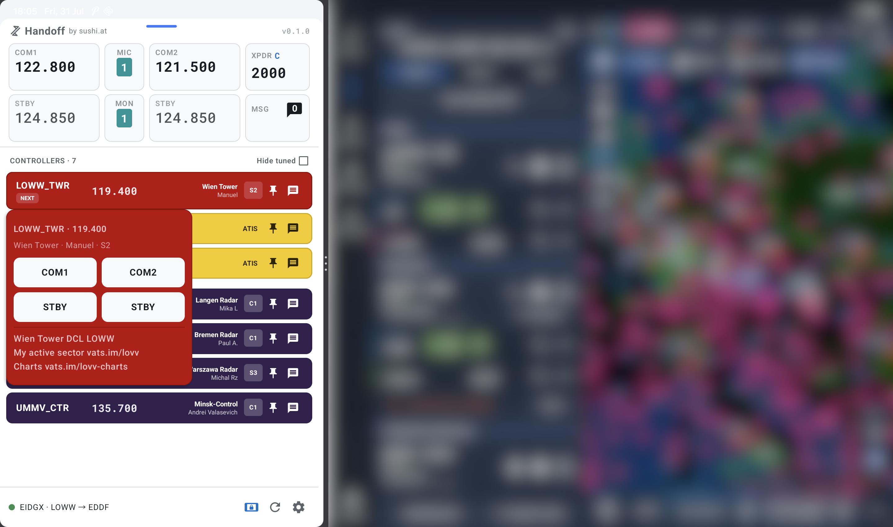

# Handoff

A companion app for [vPilot](https://vpilot.rosscarlson.dev/) that puts the online
VATSIM controller list and two-way chat on a second screen - built to run as an
Android EFB alongside your other cockpit apps (charts, performance tools, and the
like) in a home cockpit.

Unlike push-notification relay plugins, Handoff runs a local server inside the vPilot
plugin process and talks to a native Android client over your LAN. That gets you:

- **The full controller list**, live, with two-way private and radio chat you can
  actually reply from on the tablet - not just read.
- **Full radio and transponder control from the tablet**: tune COM1/COM2 active and
  standby frequencies, swap active↔standby, pick which COM transmits and which you're
  monitoring, and set the transponder code - all reflected back live from SimConnect.
- **Phase-of-flight-aware prioritization** of who you should be talking to next: the
  currently-tuned controller is pinned, then same-category peers, then the next
  station up the standard delivery→ground→tower→approach/departure→center chain -
  so the controller that actually matters right now is always the one that stands out.
- **Real sector-boundary-aware next-controller prediction**, not just distance
  guessing: actual VATGlasses sector polygons (with a VATSpy FIR-polygon fallback
  where VATGlasses has no coverage) checked against your route or heading to predict
  which controller you're about to enter airspace for, ahead of the handoff - not
  just who's nearest.
- **A glanceable floating overlay** for incoming messages and highlighted controllers,
  so you don't have to keep the app in the foreground to notice something needs your
  attention.
- **Full split-screen support** alongside whatever else is running on the tablet - the
  controller list and its button panel adapt continuously as you drag the split wider
  or narrower, from a generous 500dp down to an unobtrusive 266dp, rather than being
  designed for one fixed width.

## Screenshots

> Fullscreen controller list, light mode, with live data populated highlighting missing Vatsim flight plan.

> Dark mode, with the Settings dialog open.

> Split-screen mode, with a controller's info/tune dialog open, next to your other favourite cockpit app.

More screenshots in the [gallery](assets/gallery.md).

## Installation

Two independent pieces to install: the vPilot plugin (Windows) and the Android app.
Both come from the same [GitHub Release](../../releases), tagged together.

### Android

**Recommended: [Obtainium](https://github.com/ImranR98/Obtainium).** Install
Obtainium once, then add this repo as a source (its GitHub URL) - Obtainium finds the
release APK automatically and checks for updates from then on. This avoids repeating
the "allow installs from unknown sources" prompt for every future update.

**Manual alternative:** download the `Handoff-v*.apk` asset directly from this repo's
[Releases page](../../releases) and sideload it. You'll need to allow installs from
unknown sources for whichever app you download it with.

Either way, GitHub shows a SHA256 checksum for each release asset on the release
page itself if you want to confirm your download wasn't corrupted or tampered with
in transit.

### vPilot plugin

1. Download the `Handoff-Setup-v*.exe` asset from the same [Release](../../releases) and
   run it. No options to pick and no admin prompt - it's a per-user install, and it finds
   vPilot's `Plugins` folder on its own from the registry, so you don't need to know where
   vPilot is installed.
2. Restart vPilot if it's already running.

From then on the plugin checks for updates itself on every vPilot startup, downloads and
verifies a newer release automatically, and asks you to confirm (a small popup on the PC,
not the tablet) before installing it - no need to repeat these steps for future releases.

## Status

Functional - both `plugin/` and `android/` implement the full controller list, chat,
and ranking flow described above. Still early: expect rough edges, and see
`CHANGELOG.md` for what's shipped so far.

## Structure

- `plugin/` - C# vPilot plugin (.NET Framework 4.8), implements `IPlugin`, tracks
  controller/chat state via `IBroker`, embeds a local HTTP/WebSocket server
- `android/` - native Kotlin Android app, WebSocket client + foreground service +
  floating overlay for glanceable alerts
- `docs/protocol.md` - the WebSocket API contract between plugin and client(s); treat
  this as the source of truth if you're building an alternate client (e.g. iOS)

## Credits

Handoff's controller ranking and flight-plan awareness depend on data from:

- [VATSpy](https://github.com/vatsimnetwork/vatspy-data-project) (airport & FIR data) - 
- [VatGlasses](https://github.com/lennycolton/vatglasses-data) (sector boundaries) - 
- [VATSIM Data Feed](https://vatsim.dev) (live network data)
- [SimBrief](https://www.simbrief.com) by Navigraph (flight plan data)
- [vPilot](https://vpilot.rosscarlson.dev) (the pilot client this plugin runs inside)

Many aspects of the implementation in this repo were performed or assisted by
[Claude Code](https://claude.com/claude-code).

## Contributing

Bug reports and pull requests are welcome - see [CONTRIBUTING.md](CONTRIBUTING.md)
for how to build both components and what to include in a PR.

## License

MIT - see [LICENSE](LICENSE).
