# Gallery

More Handoff screenshots than we could fit into the [README](../README.md). Click any image to open it full-size.

<a href="https://raw.githubusercontent.com/sushiat/vpilot-handoff/master/assets/gallery/01-initial.png">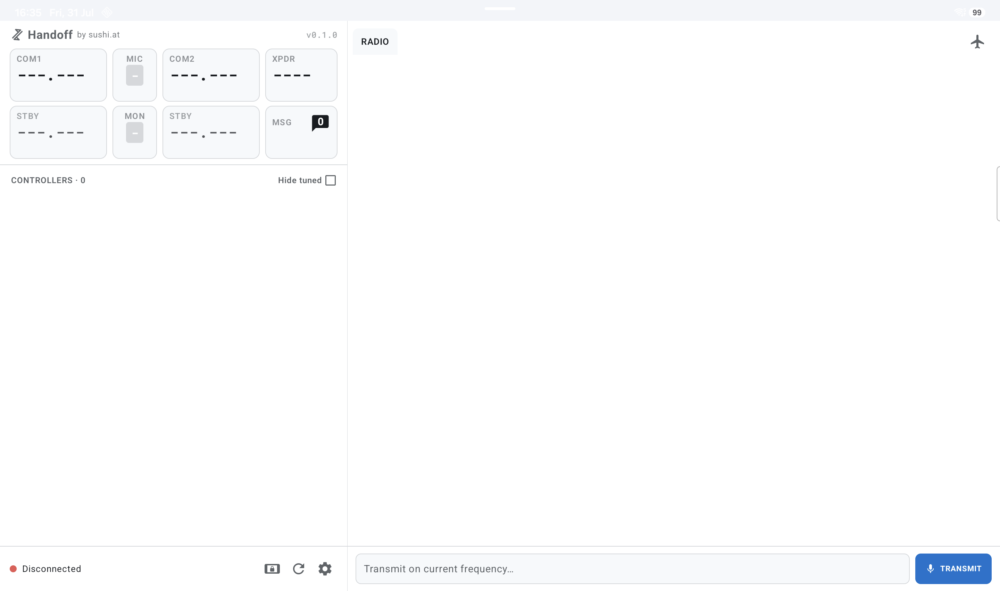</a>

> Initial state, before connecting to the plugin, full screen.

<a href="https://raw.githubusercontent.com/sushiat/vpilot-handoff/master/assets/gallery/02-pairing.png">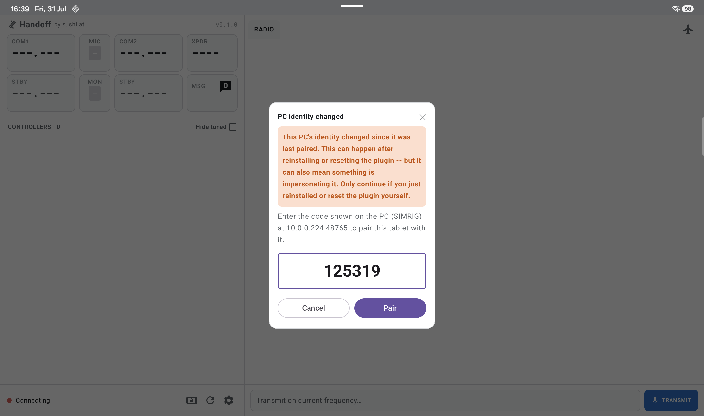</a> <a href="https://raw.githubusercontent.com/sushiat/vpilot-handoff/master/assets/gallery/03-paring-plugin.png">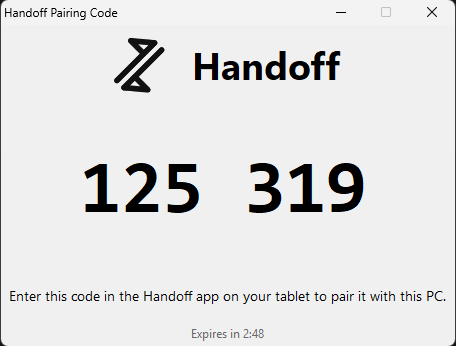</a>

> **Pairing code** - shown on the tablet before it's authenticated, including warning you if a paired computer changed its identity.
> **Pairing confirmation** - the small popup on the PC side, showing you the current pairing code.

<a href="https://raw.githubusercontent.com/sushiat/vpilot-handoff/master/assets/gallery/04-connected-missing-fpln.png">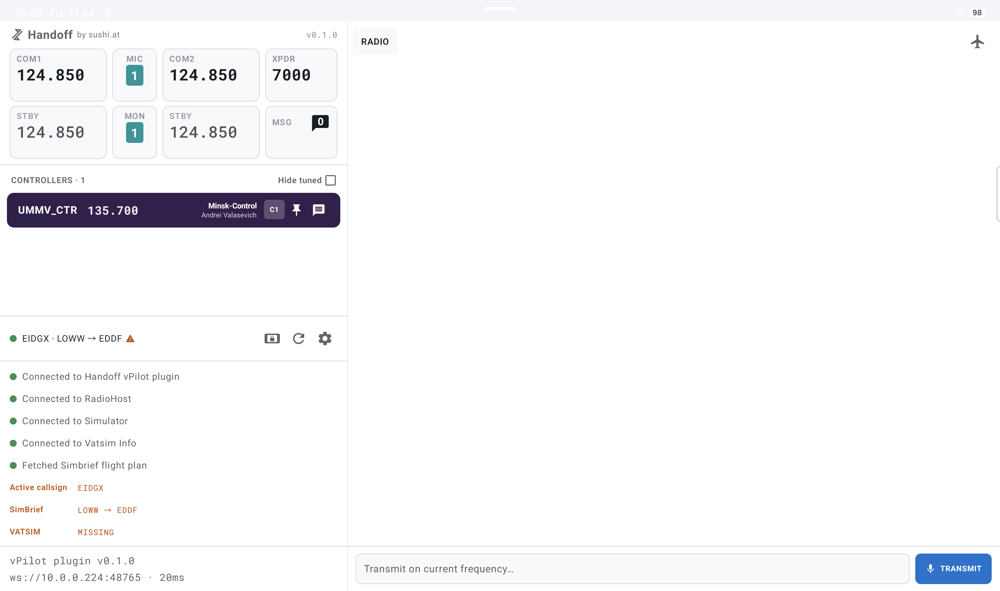</a>

> Connected, flagging that no flight plan has been filed on VATSIM yet.

<a href="https://raw.githubusercontent.com/sushiat/vpilot-handoff/master/assets/gallery/05-settings.png">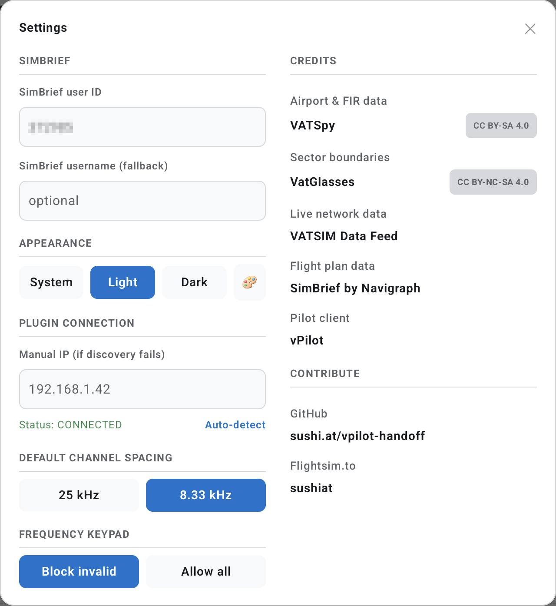</a> <a href="https://raw.githubusercontent.com/sushiat/vpilot-handoff/master/assets/gallery/06-controller-colors.png">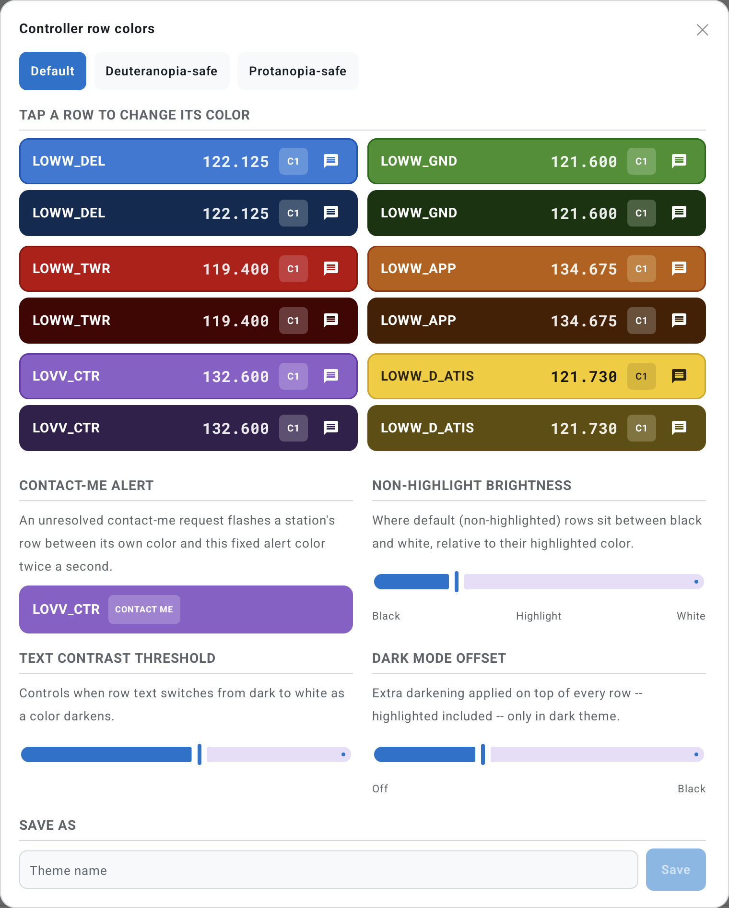</a>

> **Settings** - SimBrief, appearance, plugin connection and channel tuning settings.
> **Controller row-color theme editor** - customize the per-facility colors used across the controller list.

<a href="https://raw.githubusercontent.com/sushiat/vpilot-handoff/master/assets/gallery/07-com-tune.png">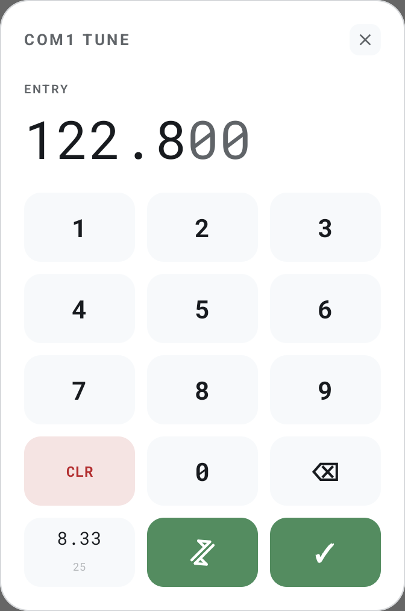</a> <a href="https://raw.githubusercontent.com/sushiat/vpilot-handoff/master/assets/gallery/08-xdpr-code.png">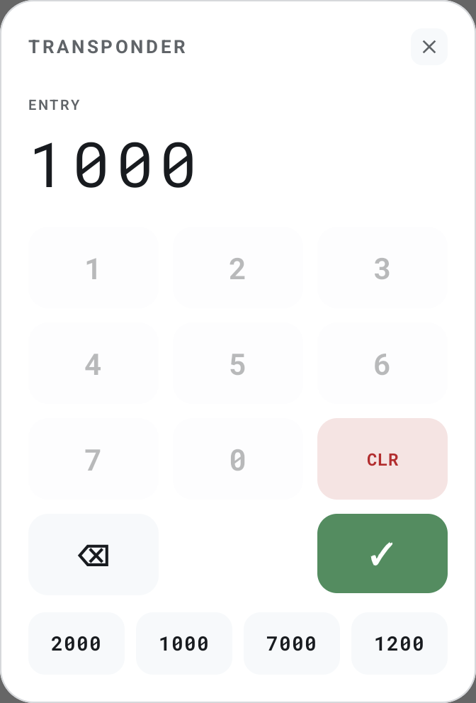</a>

> **COM tuning** - set active/standby frequency from your tablet.
> **Transponder code entry** - including common defaults.

<a href="https://raw.githubusercontent.com/sushiat/vpilot-handoff/master/assets/gallery/09-wide-split.png">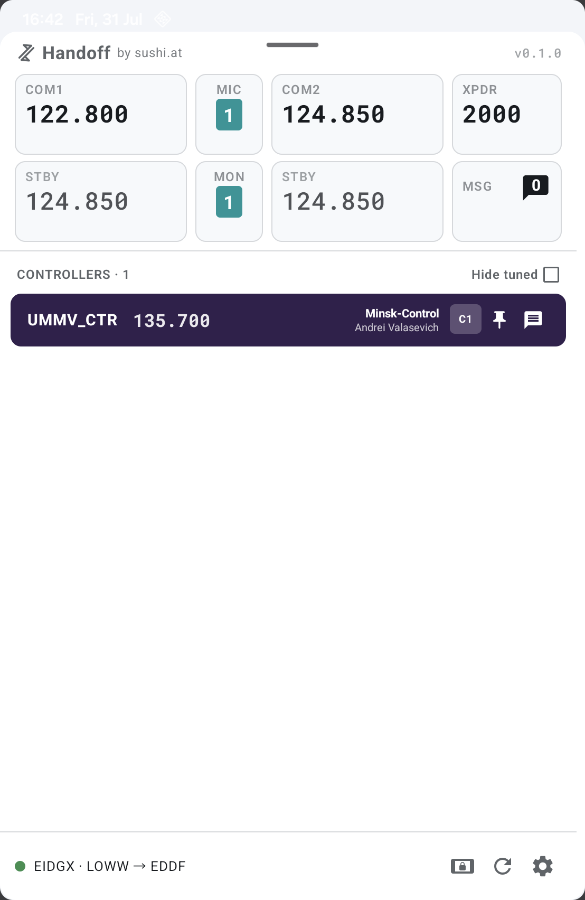</a> <a href="https://raw.githubusercontent.com/sushiat/vpilot-handoff/master/assets/gallery/10-medium-split.png">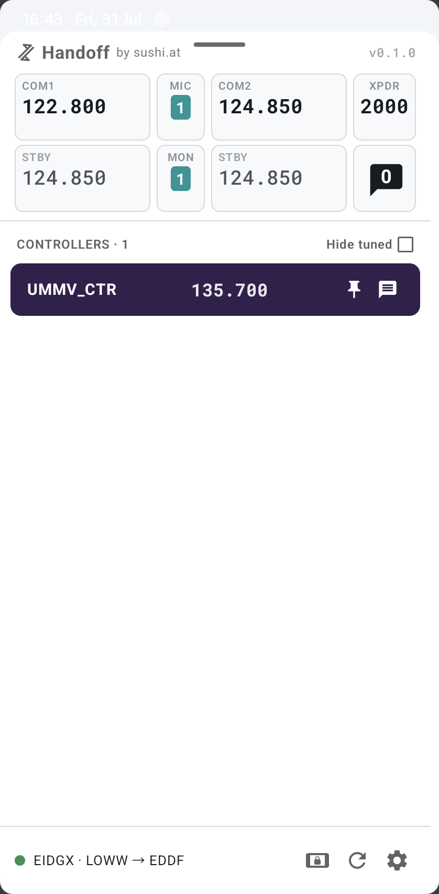</a> <a href="https://raw.githubusercontent.com/sushiat/vpilot-handoff/master/assets/gallery/11-narrow-split.png">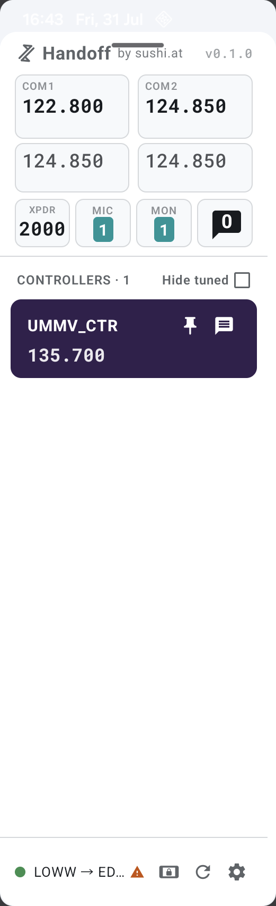</a>

> Split-screen adapts continuously across its whole supported width range, from a
> generous **wide** split down to an unobtrusive **narrow** one, rather than being
> designed for one fixed size.

<a href="https://raw.githubusercontent.com/sushiat/vpilot-handoff/master/assets/gallery/12-unread-messages.png">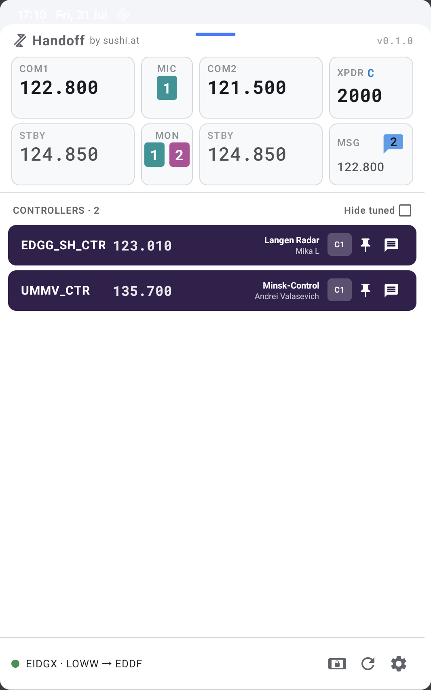</a> <a href="https://raw.githubusercontent.com/sushiat/vpilot-handoff/master/assets/gallery/14-contact-nearby-aircraft.png">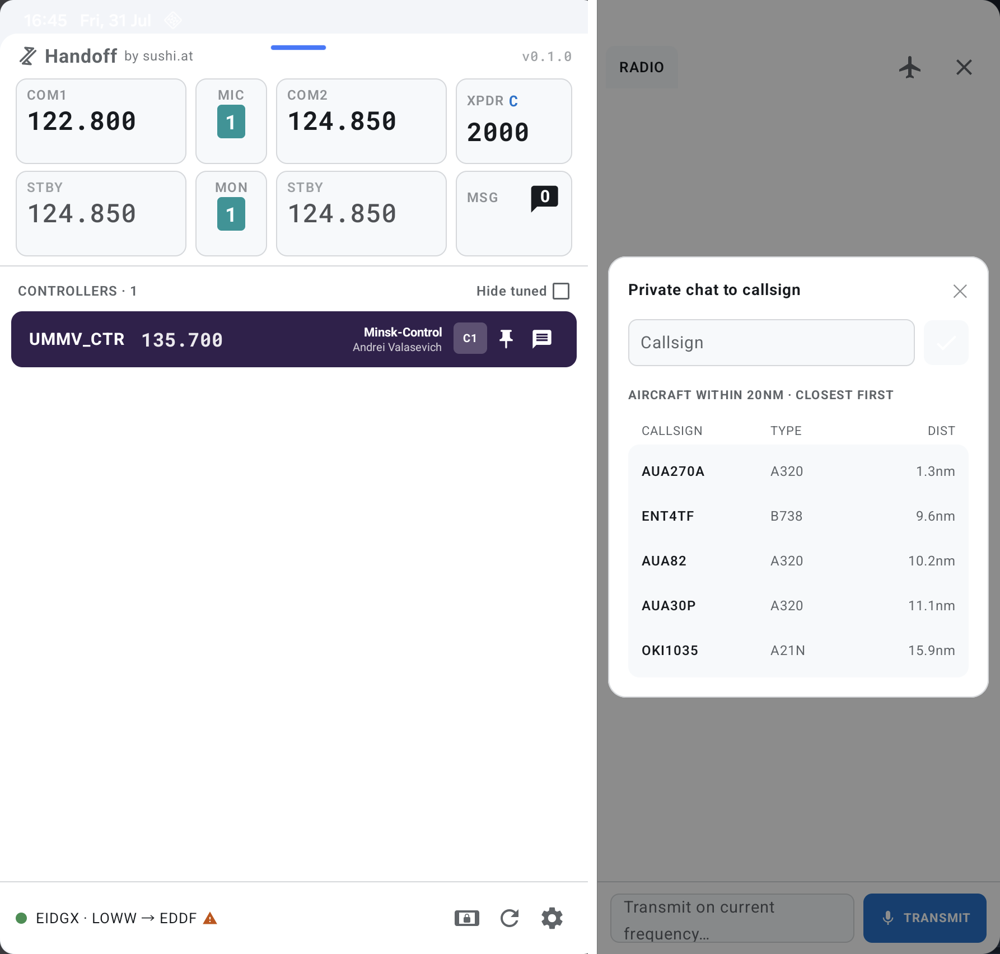</a>

> **Unread messages** - per-tab badges, directed messages flash to stand out from ambient traffic.
> **Nearby aircraft** - makes it easy to start private chats with nearby aircraft but you can also enter any callsign you want to contact.

<a href="https://raw.githubusercontent.com/sushiat/vpilot-handoff/master/assets/gallery/13-expand-msg-panel.png">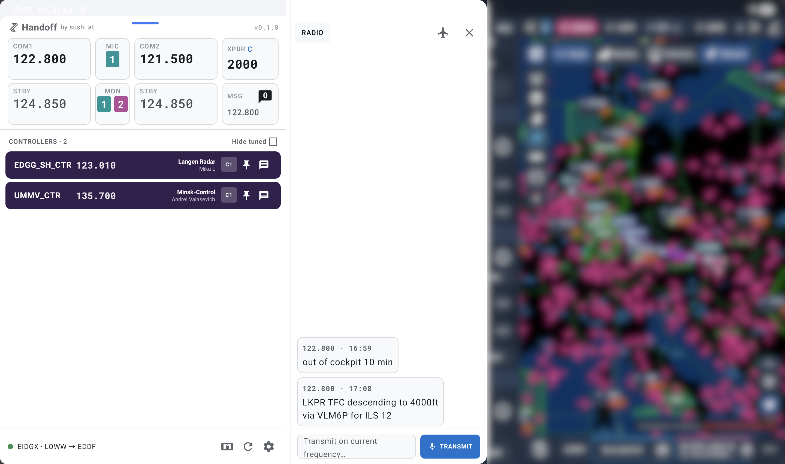</a>

> When in split screen mode, the messages section can be expanded/collapsed by tapping the MSG button. It will temporarily draw over the other app.

<a href="https://raw.githubusercontent.com/sushiat/vpilot-handoff/master/assets/gallery/15-contact-me.gif">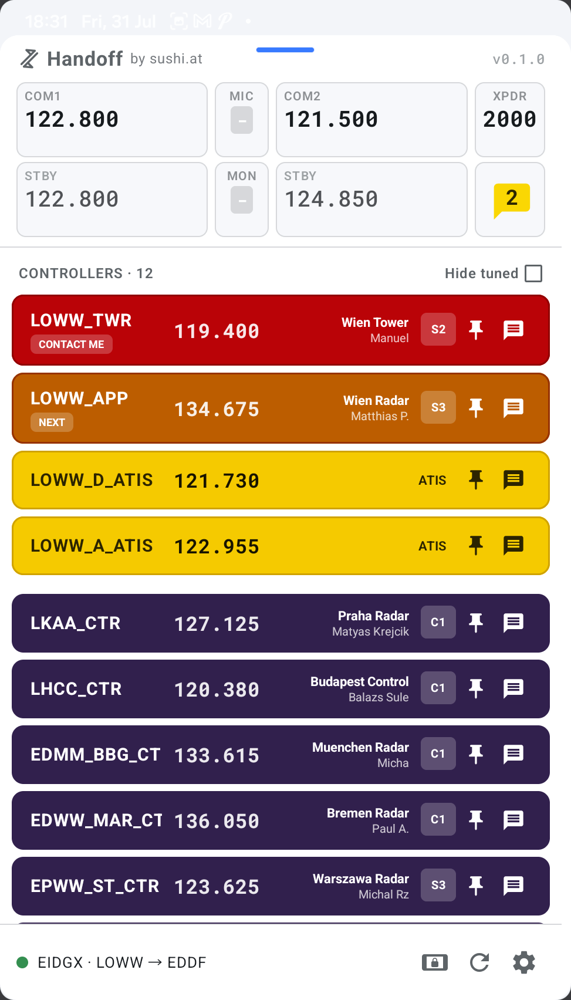</a>

> A controller sending you a CONTACT ME, will be visually highlighted until you tune the frequency.
